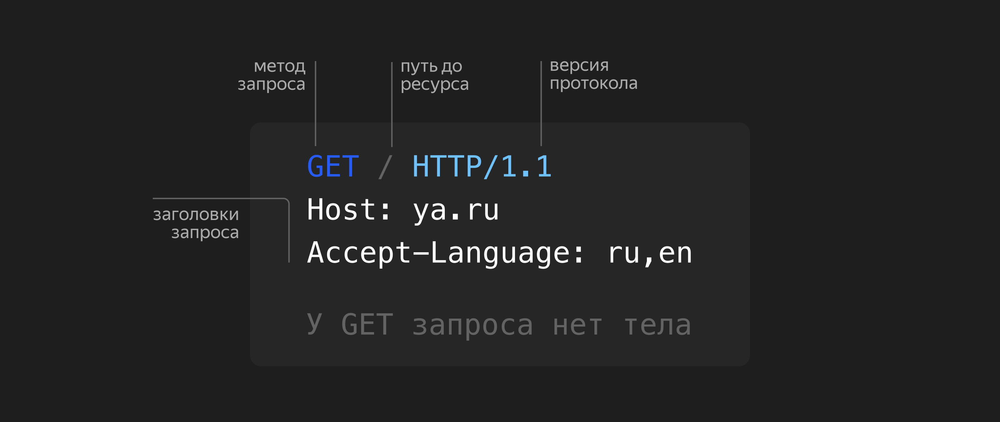
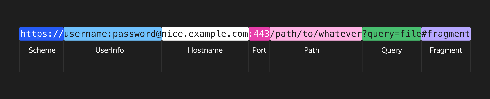

- [Протокол HTTP](#протокол-http)
- [Запрос](#запрос)
- [Строка адреса](#строка-адреса)

# Протокол HTTP
Протокол HTTP описывает правила, по которым должны взаимодействовать веб-клиент, браузер и веб-сервер. Его задача — получить и передать два вида данных: текстовую информацию в виде документов и ссылки из одних документов в другие. Текстовая информация со ссылками — это гипертекст, поэтому HTTP расшифровывается как протокол передачи гипертекста (hyper-text transfer protocol).

HTTP основан на принципе запросов (request) и ответов (response):
1. Множество клиентов подключаются к серверу.
2. Сервер при этом постоянно слушает сеть.
3. Когда у клиента появляется запрос — сервер выполняет вычисления и возвращает ответ.
   
При этом HTTP в процессе обмена данными чётко разделяет роли: здесь клиенты, а здесь — серверы.

# Запрос

Запрос — это пакет данных, который клиент передаёт серверу. Процесс передачи пакета данных устроен так:
1. В первую очередь нужно, чтобы клиент знал сетевой адрес сервера — домен или ip-адрес, а сервер находился в ожидании запроса. Если это условие выполняется, дальше всё просто.
2. Клиент подключается к серверу и отправляет ему специально оформленный пакет данных. Данные в нём выстроены особым образом, а информация разделена на служебную и пользовательскую.
3. Клиент свою задачу выполнил, запрос завершён. Дальше работа на стороне сервера: он получает строки текста и байтов, которые ему передал клиент, и читает их по определённым правилам.

Вот из чего состоит запрос главной страницы Яндекса:

Есть метод запроса — то есть цель, с которой клиент обращается к серверу. Это может быть получение данных HTML, загрузка служебных файлов CSS или JS. Ещё это может быть загрузка картинок, получение JSON от сервиса или отправка на сервер пользовательских данных. Любое из этих действий описывается глаголами GET или POST, то есть «получить» или «отправить».

# Строка адреса

Строкой адреса ещё называют URL (uniform resource locator), то есть единообразным местоположением ресурса. URL-клиент определяет поведение сервера при обработке запроса и помогает обмениваться с ним важными данными. Разберём, из чего состоит строка адреса.

- Схема протокола в адресе: http, https. Указывает, какой протокол использовать при отправке запроса. HTTPS — это тот же протокол HTTP, но с усиленными мерами безопасности.
- Информация о пользователе. Если нужно — указывается логин и пароль для доступа к ресурсу. Сейчас используется редко.
- Имя хоста (узла) — доменное имя или сетевой ip-адрес сервера, к которому будет отправлен запрос. Доменное имя — текстовое представление адреса в интернете: например, ya.ru. Без него тот же ya.ru может выглядеть так: 185.32.187.4. Такой адрес сервера сложно запомнить, поэтому для удобства придумали доменные имена.
- Порт — число от 0 до 65535. Например, когда вы заказываете доставку еды, вы сообщаете курьеру данные, по которым он может вас найти: номер дома, подъезда и квартиры. То же самое делает порт в программировании, но только он связывает программы и железо на сервере. Для общепринятых протоколов, таких как HTTP или HTTPS, принято выдавать стандартные порты: 80 и 443. При этом без разницы, какое число выбрано для работы, — само число никакого смысла не несёт.

Все вместе - Протокол, Имя хоста и Порт называют источником, или `origin`. Он используется, чтобы уникально отличить ресурсы друг от друга — например, для применения политик CORS, с которыми вы познакомитесь позже.
- Путь к ресурсу — расширенное местоположение данных на сервере. Это путь к папке и конкретному файлу.
Важный аспект безопасности протокола HTTP — если совпадают источник (origin) и путь (path), то пользователь и программисты могут быть уверены, что они запрашивают один и тот же контент.
- Запрос. После знака `?` от клиента к серверу идёт уточняющая информация. Например, это могут быть дополнительные фильтры в списке товаров. Выглядит как набор: ?ключ1=значение1&ключ2=значение2 и т. д.
- Фрагмент. После получения содержимого клиент может быть перенаправлен на какую-то область страницы. Блок «фрагмент» — это то, каким образом сервер подсказывает клиенту какую-то дополнительную информацию.